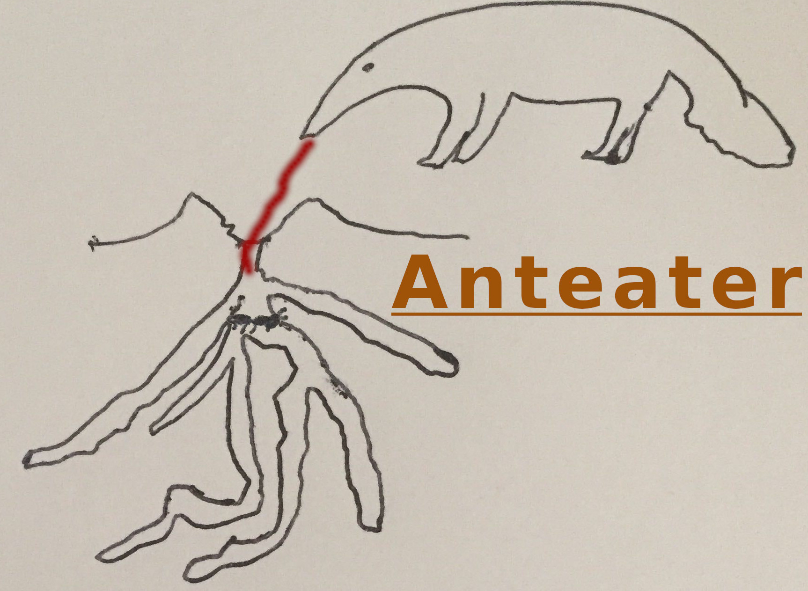

# Anteater Game

A remake of the Ludum Dare 48 competition entry "Anteater" using HTML5 Canvas and JavaScript.

## 🕹 Game Concept

You control an anteater who needs to prevent ants from digging too deep into the ground. Click on the screen to extend the anteater's tongue and eat any ants in its path.

## 🎮 How to Play

1. Open `index.html` in any modern web browser.
2. Click anywhere on the map to extend the anteater's tongue in that direction.
3. If ants are in the path of the tongue, they'll be eaten.
4. The anteater can only use its tongue once every 5 seconds.
5. Prevent ants from digging beyond the maximum depth for 2 minutes to win.

## 🐜 Game Elements

- **Ants**: Small creatures that dig tunnels and expand their colony.
- **Anteater**: Your character that can eat ants by extending its tongue.
- **Tiles**:
  - Black: Dirt (cannot be traversed by ants)
  - Brown: Tunnel (ants can walk through)
  - White: Dug tile (ants can walk through)
  - Grey: Ant lair (where ants spawn)
  - Green overlay: Pheromone trails (stronger means more ant traffic)

## 🎯 Winning and Losing

- **Win**: Survive for 2 minutes without letting ants dig too deep.
- **Lose**: If ants dig beyond row 10, you lose.

## 🧠 Ant Intelligence

Ants use A* pathfinding and pheromone trails to decide where to dig:

1. Ants follow existing tunnels using pheromones left by other ants.
2. When an ant finds dirt next to a tunnel, it digs the dirt and carries it back to the lair.
3. More ants will follow paths with stronger pheromone trails.

## 📋 Development Notes

This is a remake of the original QML/Qt-based game created for the Ludum Dare 48 competition. The original theme was "Deeper and deeper".

## 📷 Screenshots

## 🛠 Technical Details

- Built with vanilla JavaScript and HTML5 Canvas.
- Implements A* pathfinding algorithm.
- Uses pheromone-based ant movement system.
- Pixel art graphics for ants and anteater.

Enjoy the game! 